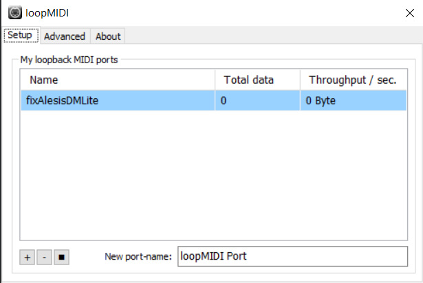

# fix-alesis-dm-lite-hihat-midi-bug-python-win32-macos-linux
A fix for the buggy Alesis DM LITE drum module high-hat midi signal.

This program is a Python version of the Linux ALSA C version found here: https://github.com/MaciekChudek/DMLITE_remapper.

The DMLITE electronic drum kit, manufactured by Alesis, comes with a drum module that sends unusual MIDI signals. When
you hit the high-hat with the high-hat pedal down, rather than sending a "Closed High-hat (42)" note, it first sends a
control signal to the Foot Control (MSB) which informs it how far the pedal is depressed, and then sends an "Open
High-hat (46)" note. Most software synths interpret this as an open high-hat sound.

This program remaps this signal to the standard codes that most software synths understand (like Melodics and DTXMania), fixing the problem.
You need to depress the pedal at 64% to close the high-hat.

The program uses the library python-rtmidi which provides a concise and simple, cross-platform API (Application Programming Interface) for realtime MIDI input / output across Linux (ALSA & JACK), macOS / OS X (CoreMIDI & JACK), and Windows (Multimedia Library) operating systems.

Note that for lower latency this program dispatches all MIDI signals immediately instead of queueing. If your software
synth can't keep up with your intensely fast drumming and starts skipping sounds, this is probably the first thing
you'll want to change (or get a faster computer).


## Installation

On Windows, you need to create a virtual MIDI port using loopMidi https://www.tobias-erichsen.de/software/loopmidi.html or
LoopBe1 https://www.nerds.de/en/loopbe1.html.
The virtual midi port name MUST contain ***FixAlesis***.


````
pip install python-rtmidi
````

## Usage

````
python main.py
````
